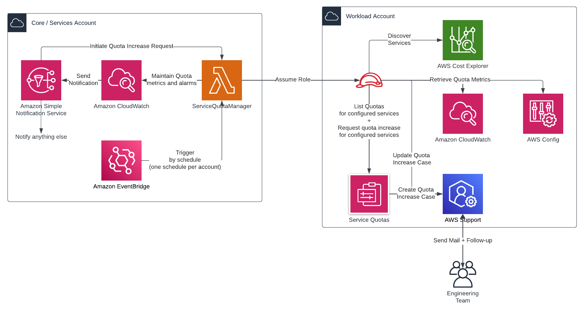

# Service Quotas Manager

:warning: **This is still a work in progress and not ready to be used yet!**




This Service Quotas Manager can be installed as part as an AWS Organization or individual account to manage service quotas and become (more) demonstrably in control of them. It currently supports the following:

1. Collection of service quotas and metrics per configured account, storing usage metrics centrally. Usage metrics can be derived from CloudWatch or AWS Config. The latter obviously requires AWS Config to be enabled in your target account.

1. Management of alarms on your service quotas with configurable thresholds per quota. Alarms can be disabled by omitting the alerting config.

1. Optionally an SNS topic can be provided as alarm action.

1. Automated requesting of service quota increases by configurable steps and motivations for support case updates (requires at least AWS Business Support and alarms to be enabled).

## Prerequisites & considerations

* To support collection of usage metrics from AWS Config, AWS Config needs to be enabled in every target account in your organization. This is usually the case in enterprise organizations.

* To support automated motivation updates on service quota increase support tickets, at least AWS Business Support is required.

* This service quota manager relies on custom CloudWatch metrics ($0.30/metric/month) and CloudWatch alarms ($0.10/alarm/month). Services to monitor are configurable; more services monitored means increased cost.

* Most quotas are applied per region. This Service Quota Manager also operates in a single region. Install the Service Quota Manager in more regions in order to support more regions.

## Setup

### Target Accounts

#### Roles
This manager works by assuming roles in your target accounts from a single central management account to collect applied service quotas and usage metrics. Every account you want to be managed requires a role that can be assumed by the service quota manager. Setting up these roles is not part of this solution but could be part of - for example - your account baseline.

Each role requires the following trust policy:

```
{
	"Version": "2012-10-17",
	"Statement": [
		{
			"Sid": "AllowServiceQuotaManager",
			"Effect": "Allow",
			"Principal": {
				"AWS": "arn:aws:iam::<manager_account_id>:role/<service_quota_manager_lambda_role_name>"
			},
			"Action": "sts:AssumeRole"
		}
	]
}
```

Each role requires the following permission policy:

```
{
    "Version": "2012-10-17",
    "Statement": [
        {
            "Sid": "AllowCloudwatchMetricData",
            "Effect": "Allow",
            "Action": "cloudwatch:GetMetricData",
            "Resource": "*"
        },
        {
            "Sid": "AllowConfigReadAccess",
            "Effect": "Allow",
            "Action": "config:SelectResourceConfig",
            "Resource": "*"
        },
        {
            "Sid": "AllowServiceQuotaAccess",
            "Effect": "Allow",
            "Action": [
                "servicequotas:ListServices",
                "servicequotas:GetServiceQuota",
                "servicequotas:ListAWSDefaultServiceQuotas",
                "servicequotas:RequestServiceQuotaIncrease",
                "servicequotas:ListRequestedServiceQuotaChangeHistoryByQuota",
                "servicequotas:ListServiceQuotas",
                "servicequotas:GetAWSDefaultServiceQuota"
            ],
            "Resource": "*"
        }
    ]
}
```

### Management Account

#### Installation

TBD

#### Configuration

See below for a sample configuration for a single account that can be passed on to the Terraform module.

* Service and quota names are as shown in the Service Quotas Console. They can be copy pasted.

```
{
  "123456789000" = {
    role_name = "ServiceQuotaManagerRole"
    selected_services = [
      "Amazon Virtual Private Cloud (Amazon VPC)",
      "Amazon Elastic Compute Cloud (Amazon EC2)",
      "AWS Lambda",
      "Amazon Elastic File System (EFS)",
      "Amazon DynamoDB",
      "Amazon Simple Storage Service (Amazon S3)"
    ]
    alerting_config = {
      default_threshold_perc = 75
      rules = {
        "AWS Lambda" = {
          "Elastic network interfaces per VPC" = {
            threshold_perc = 85
          }
        }
      }
    }
    quota_increase_config = {
      "AWS Lambda" = {
        "Elastic network interfaces per VPC" = {
          step = 50
          motivation = "We run a serverless integration platform that heavily relies on AWS Lambda. This account is a development account and we allow our developers to run feature environments to test the integrations they build in an isolated setting. In order to be able to grow the number of feature environments in this account we would like to request this quote increase. 50 Additional ENI's allow for running 1 additional feature environment, while limiting it to run on only a single AZ."
          cc_mail_addresses = ["devops_engineer@acme.com"]
        }
      }
    }
  }
}
```
